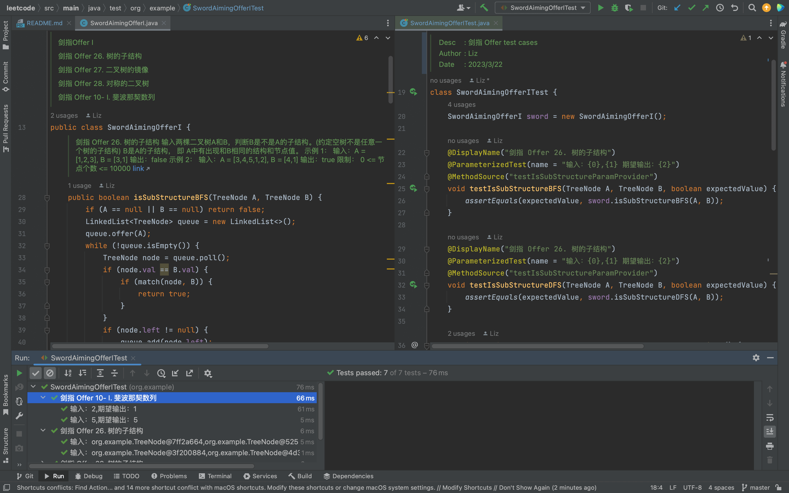

# leetcode 刷题 Log
在线刷题的 Debug 实在是太难用了，对于我们这样提交次次不过的同学来说需要顺手的 Debug 工具啦。

在 test 文件下每个题目都有对应的测试用例，Run 即可运行哦。



# 学习计划：
每一个学习计划对应一个 Class 文件。
例如`SwordAimingOfferI`对应`leetcode`中剑指Offer题单I，注释中对应题目的链接，点击可以跳转查看题解。

# 学习笔记：
很好，我是个金鱼，我今天刷过的题，明天就不会了。所以在 Readme 文件记录一些笔记。

## 判断奇偶
### 1、传统的利用取余进行判断
```
if (n % 2 == 1) {
//n为奇数
}
if (n % 2 == 0) {
//n为奇数
}
```
### 2、利用位运算&进行判断
```
if((n & 1) == 1){
// n 是个奇数。
}
if((n & 1) == 0){
// n 是个偶数。
}
```
### 3、利用异或运算^进行判断
```
if (1 ^ n == n - 1) {
//n为奇数
}
if (1 ^ n == n + 1) {
//n为偶数
```
---  

版权声明：本文为CSDN博主「wenyixicodedog」的原创文章，遵循CC 4.0 BY-SA版权协议，转载请附上原文出处链接及本声明。
原文链接：https://blog.csdn.net/wenyiCodeDog/article/details/105525681
